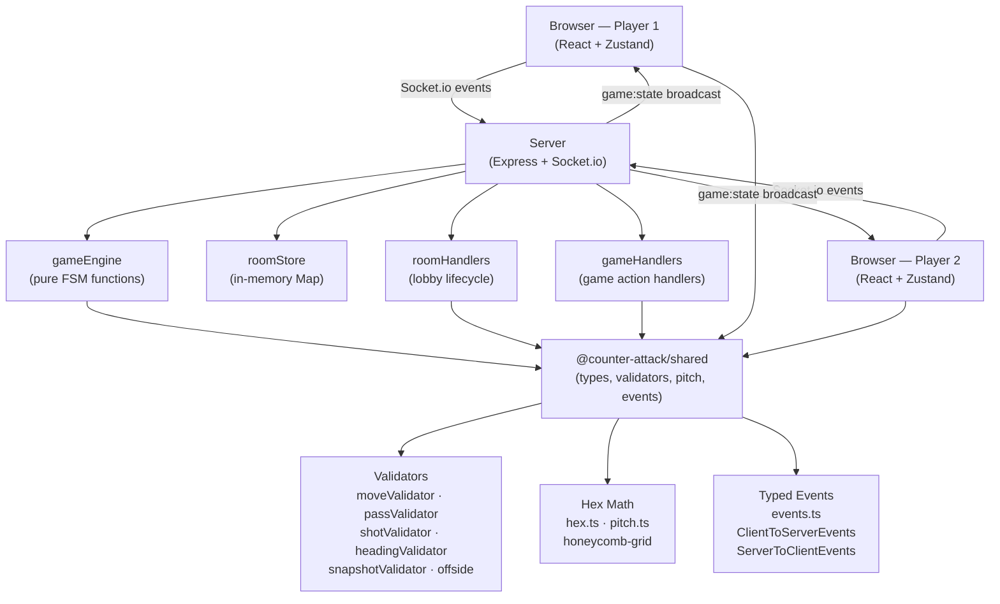

<!-- generated-by: gsd-doc-writer -->

# Architecture

## System Overview

Counter Attack POC is a real-time, two-player browser game implementing the Counter Attack hex-grid football board game. Players connect to a shared room via a five-character code, then play a complete match through their browsers over a persistent WebSocket connection. The system follows a server-authoritative event-driven architecture: every player action is an event emitted to the server, validated against the current finite-state machine (FSM) state, and resolved into a new `GameState` snapshot that is broadcast to both clients in full. No differential patching is used — every state change triggers a complete snapshot broadcast. The primary inputs are player interactions (piece clicks, dice rolls, action selections) and the primary outputs are `GameState` snapshots delivered via Socket.io to both clients simultaneously.

## Component Diagram



## Data Flow

A typical game action flows as follows:

1. **Player interaction** — The player clicks a hex cell or action button in the React UI. The component calls a Zustand store action (e.g., `emitMove`, `emitRoll`).
2. **Event emission** — The store emits a typed Socket.io client event (e.g., `game:move`, `game:roll`, `game:end-turn`) with the relevant payload (piece ID and destination hex, or pass type and target hex).
3. **Server reception and mutex** — The server's `gameHandlers.ts` receives the event. An `isProcessing` mutex on the room prevents concurrent action processing (race condition guard).
4. **Validation** — The handler calls the appropriate pure engine function from `gameEngine.ts` (e.g., `applyMove`, `applyRoll`, `applyEndTurn`). The engine imports validators from `@counter-attack/shared` (`validateMove`, `validatePass`, `validateShotDuel`, etc.) and returns a discriminated union result: `{ ok: true, state: GameState }` or `{ ok: false, reason: string }`.
5. **State persistence** — On success, the new `GameState` is written to the room record in `roomStore`'s in-memory `Map<string, Room>`. The `broadcastState` function then calls `applyFreeMoveZoneCheck` (the centralized ball-zone free-move trigger) before broadcasting.
6. **Broadcast** — `broadcastState` emits `game:state` with the full `GameState` snapshot to all sockets in the Socket.io room via `io.to(roomCode).emit`.
7. **Client reception** — Both clients receive the snapshot via their `onGameState` listener in `App.tsx`. The Zustand store is updated via `setGameState`, and the UI re-renders selectively based on Zustand subscriptions.
8. **Optimistic highlighting** — For move validation, the client computes valid move hexes locally using `validateMove` from the shared package to drive highlight rendering without a round-trip. The server remains the sole authority for resolving outcomes.

For reconnections: Socket.io's `sessionMiddleware` reads a `ca_session_token` from the handshake auth, matches it to a room slot, cancels the 90-second grace timer, and re-emits `game:state` directly to the reconnecting socket.

## Key Abstractions

The following are the most significant types, modules, and patterns in the codebase:

| Abstraction                                     | File                                          | Description                                                                                                                                                                                                                                                                                          |
| ----------------------------------------------- | --------------------------------------------- | ---------------------------------------------------------------------------------------------------------------------------------------------------------------------------------------------------------------------------------------------------------------------------------------------------- |
| `GameState`                                     | `packages/shared/src/types.ts`                | The complete, authoritative match state: piece positions, ball, phase, score, half, event log, and all phase-specific transient fields. Immutable on each transition — all mutations return new objects.                                                                                             |
| `GamePhase`                                     | `packages/shared/src/types.ts`                | String-literal union of 25+ FSM phases (`LOBBY`, `KICK_OFF_SETUP`, `KICK_OFF`, `MOVE`, `PASS`, `SHOT`, `HEADER`, `HIGH_PASS_MOVE`, `SNAPSHOT`, `LOOSE_BALL`, `GK_RESTART`, `FREE_KICK_SETUP`, `HALF_TIME`, `FULL_TIME`, `REPLAY`, and more). Drives all server-side routing and client UI rendering. |
| `ActionEvent`                                   | `packages/shared/src/types.ts`                | Discriminated union of 30+ recordable game actions appended to `GameState.eventLog` after each action. Supports undo (D-09/D-10) and end-of-game replay (D-11).                                                                                                                                      |
| `PlayerPiece`                                   | `packages/shared/src/types.ts`                | A player piece with attributes (`pace`, `shooting`, `tackling`, `dribbling`, `saving`, `handling`, `resilience`, `aerialAbility`, `highPass`) and identity fields (role, jersey number, name, nationality).                                                                                          |
| `gameEngine.ts`                                 | `packages/server/src/gameEngine.ts`           | Server-side pure-function FSM. All state transitions (`applyMove`, `applyEndTurn`, `applyRoll`, `applyUndo`, `applySnapshot`, `applyFreeMoveZoneCheck`, etc.) are stateless functions returning discriminated unions. No Socket.io imports — zero coupling to transport.                             |
| `roomStore.ts`                                  | `packages/server/src/roomStore.ts`            | In-memory `Map<string, Room>` holding all active game rooms. `broadcastState` is the single ARCH-04 entry point for all state updates — never called via `io.to().emit` directly from handlers.                                                                                                      |
| `@counter-attack/shared`                        | `packages/shared/src/index.ts`                | Single barrel export consumed by both server and client. Contains all game types, typed Socket.io event interfaces, hex math, pitch geometry, validators, team configs, and the action sequence eligibility table.                                                                                   |
| `ClientToServerEvents` / `ServerToClientEvents` | `packages/shared/src/events.ts`               | Typed Socket.io event maps enforced end-to-end. Client emits events from the `ClientEvents` const object; server emits from `ServerEvents`. Eliminates stringly-typed event names across the transport boundary.                                                                                     |
| `useGameStore` (Zustand)                        | `packages/client/src/store/useGameStore.ts`   | Client-side state store. Socket.io event listeners update it directly via `setGameState`. Component subscriptions trigger selective re-renders. Also computes derived UI state: `validMoveHexes`, `interceptionRiskHexes`, `tackleRiskHexes`.                                                        |
| Validators                                      | `packages/shared/src/moveValidator.ts` et al. | Pure functions (`validateMove`, `validatePass`, `validatePassAccuracy`, `validateShotDuel`, `validateHandlingCheck`, `validateGKDive`, `validateHeading`, `evaluateOffside`) used by both server (authoritative resolution) and client (optimistic highlight computation).                           |

## Directory Structure Rationale

```
counter-attack-poc/
├── packages/
│   ├── shared/          # @counter-attack/shared — types, validators, hex math, event contracts
│   │   └── src/
│   │       ├── types.ts          # GameState, PlayerPiece, ActionEvent, GamePhase union
│   │       ├── events.ts         # Socket.io typed event maps (ClientToServerEvents, ServerToClientEvents)
│   │       ├── hex.ts            # Axial hex math: distance, line, range, ZoI
│   │       ├── pitch.ts          # 37×26 grid definition and named pitch regions
│   │       ├── moveValidator.ts  # Piece movement validation (pace, adjacency, ZoI, steal/tackle)
│   │       ├── passValidator.ts  # Pass path validation and interception detection
│   │       ├── shotValidator.ts  # Shot duel and handling check logic
│   │       ├── headingValidator.ts # Aerial duel validation
│   │       ├── snapshotValidator.ts # Snapshot eligibility and GK penalty calculation
│   │       ├── offside.ts        # Offside evaluation and free-kick setup helpers
│   │       ├── actionSequence.ts # ELIGIBLE_NEXT_ACTIONS table — FSM action routing
│   │       ├── teamConfig.ts     # Team identity types and TEAM_SQUADS roster data
│   │       └── scoreUtils.ts     # Match clock and score helpers
│   │
│   ├── server/          # @counter-attack/server — Node.js + Express + Socket.io
│   │   └── src/
│   │       ├── main.ts           # Entry point: buildServer() + httpServer.listen()
│   │       ├── createServer.ts   # Express + Socket.io factory; /health and /healthz endpoints; SPA serving in production
│   │       ├── roomStore.ts      # In-memory Map<string, Room>; broadcastState entry point
│   │       ├── gameEngine.ts     # Pure FSM functions — all GameState transitions
│   │       ├── roomHandlers.ts   # Socket.io handlers for lobby lifecycle (create, join, team pick, disconnect)
│   │       ├── gameHandlers.ts   # Socket.io handlers for game actions (move, roll, end turn, undo, etc.)
│   │       ├── sessionMiddleware.ts # Socket.io middleware for reconnect session token resolution
│   │       └── diceUtils.ts      # Dice roll utilities for handlers
│   │
│   └── client/          # @counter-attack/client — React + Vite SPA
│       └── src/
│           ├── main.tsx          # React DOM root
│           ├── App.tsx           # Socket.io listener setup and screen routing
│           ├── socket.ts         # Module-singleton socket.io-client instance
│           ├── store/
│           │   └── useGameStore.ts  # Zustand store: game state, UI state, socket emit actions
│           ├── components/       # React components (GameBoard, HexGrid, HexCell, ActionPanel, LobbyScreen, etc.)
│           └── utils/            # Client-side utilities
│
├── docs/                # Project documentation
├── tsconfig.base.json   # Shared TypeScript compiler options (strict, ES2022, noUncheckedIndexedAccess)
├── pnpm-workspace.yaml  # pnpm workspaces — packages/*
├── eslint.config.js     # Monorepo-wide ESLint configuration
└── render.yaml          # Render.com deployment configuration (current hosting)
```

**Rationale:**

- `packages/shared` exists so that types and validators are defined once and imported by both server and client. This prevents type drift on the transport boundary and allows the client to run the same validation logic for optimistic UI highlighting.
- `packages/server` is the sole authority for all FSM transitions. `gameEngine.ts` is kept socket-free (pure functions only) so every transition is unit-testable without a running server.
- `packages/client` is a static Vite build. In production, Express serves the `packages/client/dist` directory as a SPA fallback, collocating frontend and backend in one deployment unit. The `VITE_SOCKET_URL` environment variable decouples the socket endpoint from the build for split deployments.
- The monorepo uses pnpm workspaces so `@counter-attack/shared` is resolved as a local workspace dependency without publishing to npm.

## Architectural Principles

The following invariants are enforced across the codebase and referenced by code comments:

- **ARCH-01 — Server-authoritative state.** All FSM transitions are validated and resolved server-side. Client-supplied coordinates, piece claims, or phase values are never trusted directly; the server always derives authoritative values from its stored `GameState`.
- **ARCH-04 — Single broadcast entry point.** `broadcastState` in `roomStore.ts` is the only place `game:state` is emitted to the room. No handler calls `io.to(roomCode).emit` directly. This ensures the free-move zone check (`applyFreeMoveZoneCheck`) runs on every state change without per-handler duplication.
- **SC-5 — isProcessing mutex.** Every game handler acquires the room's `isProcessing` flag before processing and releases it in a `finally` block, preventing concurrent duplicate action processing.
- **SC-3 — 90-second reconnect grace.** On disconnect, a 90-second timeout is set before the room is deleted. Reconnecting sockets cancel the timer, re-join the Socket.io room, and receive the current `GameState` snapshot.
- **Pure engine functions.** `gameEngine.ts` imports nothing from Socket.io. All functions are deterministic given injected dice values, making them directly unit-testable with Vitest.
